# Laporan Proyek Machine Learning - Tabita Novi Sinaga

## Domain Proyek
#### Latar Belakang
Domain proyek Medical Insurance Cost Prediction ini berada dalam ranah industri asuransi kesehatan, sebuah sektor yang berperan penting dalam memberikan perlindungan finansial terhadap risiko kesehatan individu dan keluarga. Dalam industri ini, perusahaan asuransi menetapkan biaya premi yang harus dibayarkan oleh pemegang polis sebagai imbalan atas perlindungan yang diberikan terhadap biaya medis yang mungkin timbul di masa depan.

Proyek ini memiliki relevansi yang kuat dengan industri asuransi kesehatan, terutama dalam mendukung penentuan biaya asuransi yang lebih akurat. Dengan memanfaatkan data seperti usia, jenis kelamin, indeks massa tubuh (BMI), jumlah anak tanggungan, status merokok, wilayah tempat tinggal, dan biaya medis sebelumnya, model prediktif yang dikembangkan dalam proyek ini dapat membantu perusahaan asuransi memproyeksikan biaya asuransi secara lebih tepat. Perhitungan berbasis data ini memungkinkan penetapan premi yang selaras dengan risiko kesehatan masing-masing individu.

Selain itu, model ini juga mendorong terciptanya sistem penetapan biaya yang lebih adil bagi calon pemegang polis. Dengan mempertimbangkan berbagai variabel risiko secara menyeluruh, pendekatan berbasis data ini dapat mengurangi kemungkinan diskriminasi dalam penetapan premi, sehingga menghasilkan biaya asuransi yang lebih sesuai dan proporsional dengan kondisi calon nasabah.

Dari sisi perusahaan asuransi, penggunaan model prediktif ini tidak hanya meningkatkan akurasi dalam estimasi biaya, tetapi juga membantu dalam pengelolaan risiko keuangan dan efisiensi operasional. Sementara itu, bagi calon pemegang polis, model ini dapat memberikan gambaran yang lebih transparan dan rasional mengenai biaya yang akan mereka tanggung, sehingga mereka dapat merasa lebih yakin terhadap perlindungan kesehatan yang diperoleh.

Secara keseluruhan, proyek Medical Insurance Cost Prediction ini tidak hanya berkontribusi dalam pengambilan keputusan berbasis data di sektor asuransi kesehatan, tetapi juga membuka peluang untuk menciptakan sistem asuransi yang lebih adil, efisien, dan berorientasi pada kebutuhan individu.

## Business Understanding
Proyek Medical Insurance Cost Prediction ini dikembangkan untuk mendukung perusahaan asuransi kesehatan yang memiliki komitmen terhadap pemanfaatan teknologi dan analisis data guna meningkatkan kualitas pengambilan keputusan bisnis mereka. Perusahaan seperti ini biasanya memiliki kumpulan data pelanggan yang kaya dan terstruktur, mencakup informasi penting seperti usia, jenis kelamin, indeks massa tubuh (BMI), jumlah anak tanggungan, status merokok, wilayah tempat tinggal, serta biaya medis yang telah dikeluarkan. Dengan memanfaatkan data ini, perusahaan berupaya untuk membangun model prediktif yang mampu memperkirakan biaya medis secara akurat, sehingga premi yang dikenakan kepada calon pemegang polis dapat ditentukan berdasarkan risiko yang sesungguhnya. Permasalahan utama yang ingin diselesaikan dalam proyek ini adalah bagaimana perusahaan asuransi dapat menentukan estimasi biaya asuransi kesehatan secara lebih akurat dan efisien dengan mengandalkan data historis pelanggan. Selama ini, penetapan premi sering kali dilakukan secara umum dan tidak mempertimbangkan secara mendalam faktor-faktor risiko individu, yang bisa menyebabkan ketidakadilan dalam pembebanan biaya serta ketidaktepatan dalam mengelola risiko keuangan perusahaan. Tanpa pendekatan berbasis data, perusahaan juga kesulitan dalam mengoptimalkan efisiensi proses dan menghadapi persaingan yang semakin ketat di industri asuransi.

Tujuan dari proyek ini adalah mengembangkan model analisis prediktif berbasis machine learning yang mampu memproyeksikan biaya asuransi kesehatan dengan mempertimbangkan karakteristik individu masing-masing pelanggan. Model ini diharapkan dapat memberikan estimasi yang lebih tepat terhadap biaya yang akan dikeluarkan calon pemegang polis, memungkinkan perusahaan untuk menetapkan premi yang lebih adil, informasional, dan kompetitif. Selain itu, model ini bertujuan untuk meningkatkan efisiensi operasional perusahaan dengan mengotomatisasi proses estimasi biaya, serta memperkuat posisi perusahaan dalam pasar asuransi dengan strategi penetapan harga yang lebih cerdas dan berbasis risiko nyata. Dengan pendekatan ini, perusahaan dapat mengurangi kerugian yang tidak terduga, memperkuat hubungan dengan pelanggan, dan meningkatkan daya saing jangka panjang di industri.

### Problem Statements
- Pernyataan Masalah 1
Bagaimana meningkatkan akurasi dalam memperkirakan biaya asuransi kesehatan berdasarkan karakteristik individu?

Perusahaan asuransi kesehatan sering menghadapi kesulitan dalam menetapkan biaya asuransi yang tepat bagi calon pemegang polis karena keterbatasan dalam memahami dan memanfaatkan faktor-faktor risiko yang relevan. Tanpa pendekatan berbasis data dan analisis prediktif, estimasi biaya dapat menjadi terlalu umum dan tidak mencerminkan kondisi nyata individu, sehingga menyebabkan ketidakakuratan dalam penetapan premi.

- Pernyataan Masalah 2
Bagaimana menciptakan sistem penetapan premi yang lebih transparan agar dapat dipahami oleh calon pemegang polis?

Calon nasabah sering merasa bingung dan kurang percaya terhadap sistem penetapan premi karena tidak adanya kejelasan mengenai faktor apa saja yang memengaruhi besaran premi mereka. Minimnya transparansi ini bisa menimbulkan persepsi bahwa perusahaan asuransi bersikap tidak adil dalam menentukan biaya asuransi, padahal terdapat faktor-faktor objektif seperti usia, kebiasaan merokok, dan indeks massa tubuh (BMI) yang seharusnya bisa dijelaskan secara terbuka.

- Pernyataan Masalah 3
Bagaimana mengurangi risiko keuangan perusahaan akibat penetapan premi yang tidak sebanding dengan risiko kesehatan nasabah?

Premi yang ditetapkan terlalu rendah bagi individu dengan risiko tinggi dapat menyebabkan perusahaan menanggung klaim melebihi pendapatan dari premi tersebut. Sebaliknya, premi yang terlalu tinggi dapat menurunkan minat masyarakat untuk membeli asuransi. Keduanya sama-sama menimbulkan kerugian bagi perusahaan baik dari sisi finansial maupun persaingan di pasar.

Ketiga pernyataan masalah tersebut merupakan tantangan nyata yang dihadapi oleh perusahaan asuransi kesehatan saat ini. Oleh karena itu, melalui proyek Medical Insurance Cost Prediction ini, akan dikembangkan sebuah model prediktif berbasis machine learning yang bertujuan untuk:
- Menyediakan estimasi biaya asuransi yang lebih akurat berdasarkan karakteristik individu.
- Meningkatkan transparansi dengan mengidentifikasi dan menjelaskan faktor-faktor signifikan yang memengaruhi premi.
- Membantu perusahaan mengelola risiko keuangan secara lebih efektif dengan penetapan premi yang sesuai dengan tingkat risiko masing-masing calon pemegang polis.

### Goals
- Jawaban Pernyataan Masalah 1: Mengembangkan model prediktif yang akurat dalam memperkirakan biaya asuransi kesehatan

Tujuan utama dari proyek ini adalah membangun sebuah model prediktif berbasis machine learning yang mampu memperkirakan biaya premi asuransi kesehatan secara lebih akurat. Dengan memanfaatkan data seperti usia, jenis kelamin, BMI, status merokok, jumlah anak, dan wilayah tempat tinggal, model ini akan mengidentifikasi pola yang dapat digunakan untuk membuat prediksi premi yang tepat dan sesuai dengan karakteristik masing-masing individu. Pendekatan ini diharapkan dapat mengatasi ketidakakuratan dalam penentuan premi yang selama ini terjadi karena kurangnya analisis data yang komprehensif.

-Jawaban Pernyataan Masalah 2: Meningkatkan pemahaman dan transparansi dalam penetapan premi asuransi

Proyek ini juga bertujuan untuk menjawab keresahan calon pemegang polis terhadap kurangnya transparansi dalam proses penentuan premi. Dengan menganalisis faktor-faktor yang paling berpengaruh terhadap besaran premi, proyek ini akan membantu perusahaan asuransi memberikan penjelasan yang logis dan mudah dipahami mengenai alasan di balik nilai premi yang ditetapkan. Hasil ini dapat digunakan untuk menyusun laporan atau dashboard yang informatif, sehingga membangun kepercayaan dan meningkatkan kepuasan pelanggan terhadap kebijakan penetapan premi.

- Jawaban Pernyataan Masalah 3: Mengurangi potensi risiko finansial bagi perusahaan asuransi

Proyek ini juga bertujuan membantu perusahaan asuransi dalam mengelola risiko keuangan yang muncul akibat penetapan premi yang tidak sesuai dengan tingkat risiko kesehatan individu. Dengan memperkirakan premi berdasarkan parameter yang relevan, perusahaan dapat menghindari skenario di mana premi terlalu rendah bagi individu berisiko tinggi atau terlalu tinggi bagi individu berisiko rendah. Akurasi prediksi ini akan mendukung perencanaan keuangan dan kebijakan underwriting yang lebih sehat serta menjaga keseimbangan antara pendapatan dan potensi klaim.

Metrik Evaluasi yang Digunakan
Untuk mengukur sejauh mana tujuan-tujuan di atas tercapai, proyek ini akan menggunakan:
Mean Squared Error (MSE): Digunakan untuk menilai seberapa dekat hasil prediksi premi dengan nilai aktualnya. Semakin rendah MSE, semakin baik performa model dalam memperkirakan premi secara akurat.

Dengan menetapkan tujuan yang jelas dan metrik yang relevan, proyek ini tidak hanya akan meningkatkan kualitas prediksi premi, tetapi juga membantu perusahaan asuransi membangun sistem yang lebih adil, transparan, dan berkelanjutan.

### Solution Statements
Untuk mencapai tujuan dari proyek ini, yaitu membangun model prediktif yang akurat dalam memperkirakan biaya premi asuransi kesehatan, beberapa tahapan dan pendekatan machine learning telah dirancang sebagai berikut:

1. Eksplorasi Data (Exploratory Data Analysis - EDA)
Langkah awal yang dilakukan adalah eksplorasi data secara menyeluruh guna memahami distribusi data, pola hubungan antar fitur, serta mendeteksi adanya outlier atau nilai yang hilang. EDA juga membantu dalam proses pra-pemrosesan seperti encoding fitur kategorikal, normalisasi data jika diperlukan, serta seleksi fitur yang relevan untuk proses pelatihan model. Melalui EDA, kita dapat menemukan wawasan yang akan memperkuat kualitas dan interpretabilitas model.

2. Algoritma Random Forest
Random Forest dipilih karena memiliki kemampuan dalam menangani fitur numerik dan kategorikal secara efektif, serta tahan terhadap overfitting karena menggunakan prinsip bagging (penggabungan banyak pohon keputusan). Model ini akan memprediksi biaya premi dengan membentuk banyak pohon keputusan dan menghasilkan rata-rata prediksi sebagai output akhir.
Evaluasi kinerja model akan dilakukan menggunakan metrik Mean Squared Error (MSE) untuk mengetahui seberapa akurat prediksi premi dibandingkan nilai sebenarnya. Selain itu, feature importance dari Random Forest juga dapat digunakan untuk mendukung transparansi dalam penetapan premi.

3. Algoritma AdaBoost
AdaBoost (Adaptive Boosting) digunakan sebagai pendekatan tambahan untuk meningkatkan akurasi prediksi. Dengan menggabungkan beberapa model lemah secara iteratif dan memberikan bobot lebih pada prediksi yang sebelumnya salah, AdaBoost diharapkan mampu meningkatkan performa model secara bertahap.
Penggunaan AdaBoost memungkinkan kita untuk membandingkan apakah pendekatan boosting lebih unggul dibandingkan bagging seperti pada Random Forest. Evaluasi tetap menggunakan MSE untuk memastikan pendekatan mana yang memberikan error paling rendah dalam prediksi premi.

4. K-Nearest Neighbors (KNN)
KNN dipilih sebagai baseline model yang sederhana namun dapat memberikan gambaran awal performa prediksi berdasarkan kesamaan fitur dengan individu lainnya. KNN akan memprediksi premi berdasarkan rata-rata premi dari sejumlah tetangga terdekat dalam ruang fitur.
Meskipun KNN tidak sekompleks algoritma ensemble, model ini dapat menjadi acuan untuk membandingkan efektivitas model Random Forest dan AdaBoost. Evaluasi juga dilakukan dengan MSE, dan hasilnya akan digunakan sebagai titik acuan (baseline).

Evaluasi dan Pemilihan Model Terbaik
Setiap model akan dibandingkan berdasarkan metrik Mean Squared Error (MSE), dan model dengan MSE terendah akan dipilih sebagai model final. Selain itu, metrik tambahan seperti R-squared (R²) dan MAE (Mean Absolute Error) juga dapat digunakan sebagai pendukung evaluasi.

## Data Understanding
Dataset: [Medical Insurance Cost Prediction](https://www.kaggle.com/datasets/rahulvyasm/medical-insurance-cost-prediction).

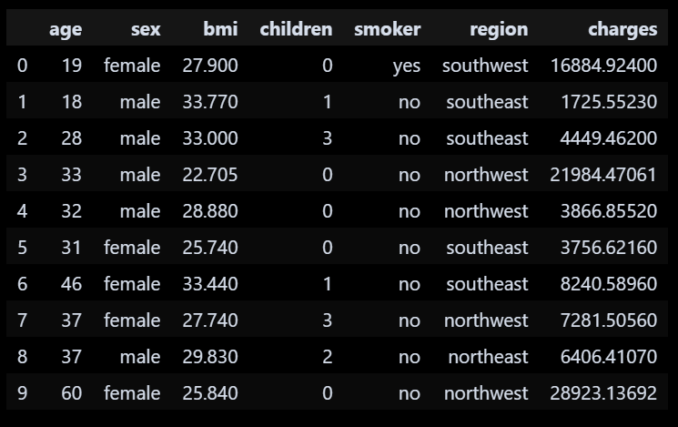
- Usia peserta berkisar 18–60 tahun, makin tua biaya asuransi cenderung lebih tinggi.
- Terdapat peserta laki-laki dan perempuan
- BMI bervariasi, BMI tinggi biasanya berhubungan dengan risiko dan biaya lebih tinggi.
- Jumlah anak dari 0 sampai 3
- Peserta yang merokok umumnya memiliki biaya asuransi lebih tinggi.
- Peserta tersebar di 4 wilayah (southwest, southeast, northwest, northeast), biaya bisa berbeda per wilayah.
- Biaya asuransi sangat bervariasi, dipengaruhi oleh usia, merokok, BMI, dan wilayah.

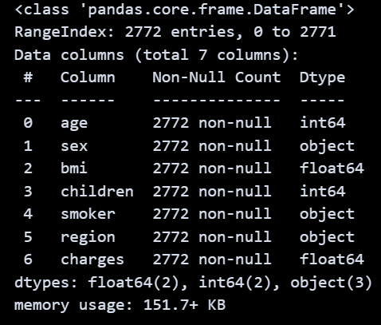
Dataset memiliki 2772 baris (entri) dan 7 kolom (fitur)
- 2 fitur bertipe numerik float64 (bmi, charges)
- 2 fitur bertipe numerik integer (age, children)
- 3 fitur bertipe kategorikal/string (sex, smoker, region)
Ukuran memori dataset sekitar 151.7 KB.

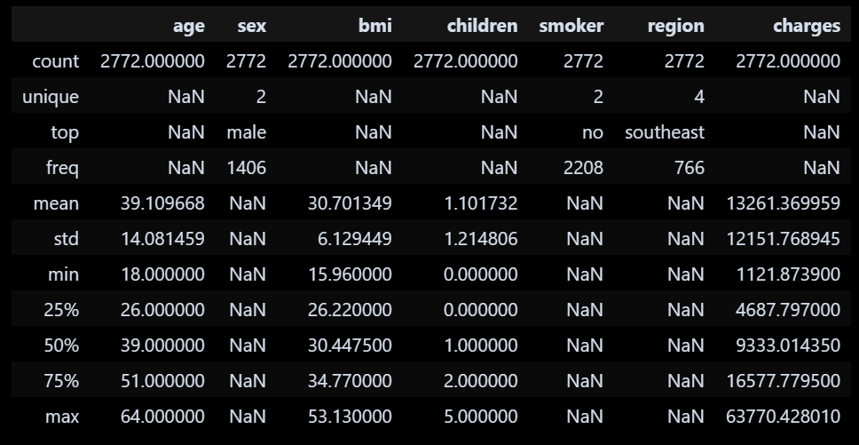
- Jumlah data: 2772 baris
- Jenis kelamin: 2 kategori (male paling banyak, 1406)
- Status merokok: 2 kategori (non-smoker terbanyak, 2208)
- Region: 4 kategori (southeast paling sering, 766)
- Rata-rata usia: 39 tahun (rentang 18–64)
- Rata-rata BMI: 30.7 (rentang 16–53)
- Rata-rata anak: 1.1 (0–5)
- Rata-rata biaya asuransi: 13,261 (dari 1,122 sampai 63,770)

Handling Missing Value
Tidak ada missing value pada data

Handling Outliers
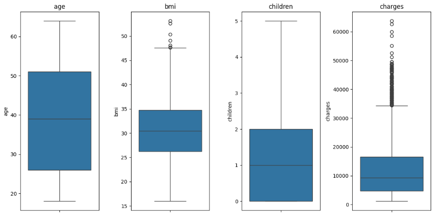
Usia dan jumlah anak bersih dari outlier, BMI ada sedikit outlier, sementara charges memiliki cukup banyak outlier mahal yang perlu diperhatikan dalam analisis.

### Variabel-variabel pada Medical Insurance Cost Prediction dataset adalah sebagai berikut:
- Age : Merupakan usia pasien dalam tahun. Fitur ini penting karena biaya premi asuransi biasanya meningkat seiring bertambahnya usia.
- Sex : Jenis kelamin pasien, biasanya terdiri dari nilai "male" dan "female". Beberapa perusahaan asuransi mempertimbangkan jenis kelamin dalam menentukan premi karena perbedaan risiko kesehatan.
- BMI (Body Mass Index): Merupakan nilai indeks massa tubuh, dihitung dari berat dan tinggi badan pasien. Nilai BMI yang tinggi menunjukkan kelebihan berat badan yang dapat meningkatkan risiko penyakit tertentu.
- Children: Jumlah anak yang dimiliki oleh pasien. Dalam beberapa kebijakan asuransi, jumlah tanggungan (anak) dapat memengaruhi biaya premi.
- Smoker: Menunjukkan apakah pasien adalah perokok atau bukan. Perokok memiliki risiko kesehatan yang lebih tinggi sehingga biasanya dikenakan premi lebih mahal.
- Region: Lokasi geografis tempat tinggal pasien, seperti "southeast", "southwest", "northeast", atau "northwest". Lokasi dapat memengaruhi biaya layanan kesehatan dan kebijakan premi.
- Charges
Total biaya medis atau premi asuransi yang dibebankan kepada pasien. Ini adalah variabel target (label) yang ingin diprediksi dalam proyek ini.

Visualisasi proses Data Understanding

OUTLIER:

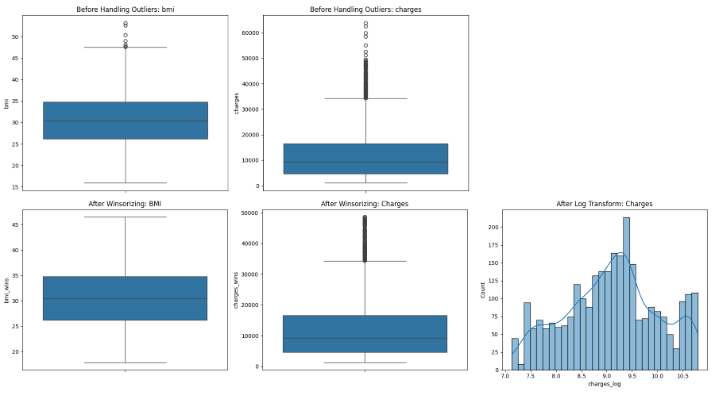
Untuk mengidentifikasi dan menangani outlier, salah satu metode yang sering dipakai adalah metode Interquartile Range (IQR), yang biasanya divisualisasikan menggunakan boxplot. Metode IQR sendiri merupakan ukuran statistik yang menggambarkan rentang sebaran data pada bagian tengah distribusi dengan cara menghitung selisih antara kuartil ketiga (Q3) dan kuartil pertama (Q1). Outlier kemudian didefinisikan sebagai data yang berada di luar batas tertentu, yaitu di bawah batas bawah atau di atas batas atas yang dihitung berdasarkan IQR. Prosesnya dimulai dengan menentukan nilai Q1 dan Q3, kemudian menghitung IQR sebagai selisih Q3 dan Q1. Selanjutnya, batas atas dan batas bawah outlier dihitung dengan rumus: batas atas = Q3 + 1.5 kali IQR, dan batas bawah = Q1 - 1.5 kali IQR. Data yang nilainya melewati batas ini dianggap sebagai outlier.

Dengan menerapkan metode IQR dan visualisasi boxplot, kita dapat mengenali dan menangani outlier dalam data. Outlier merupakan nilai ekstrem yang tidak lazim dan berpotensi mempengaruhi hasil analisis statistik maupun model prediksi. Dengan melihat rentang IQR dan visualisasi boxplot, kita bisa menetapkan batas atas dan batas bawah outlier, lalu mengambil langkah yang tepat seperti menghapus atau mengelola outlier tersebut agar hasil analisis tetap akurat.

Selain itu, untuk memahami sebaran data secara menyeluruh, histogram dapat digunakan sebagai alat visualisasi yang efektif. Histogram menampilkan distribusi frekuensi suatu variabel dalam bentuk interval atau bin. Proses analisis sebaran data dengan histogram dimulai dengan membagi data ke dalam interval yang sesuai, dimana jumlah dan lebar bin dapat ditentukan berdasarkan aturan seperti Sturges atau Scott’s rule. Selanjutnya, frekuensi data pada setiap interval dihitung, lalu divisualisasikan dalam bentuk bar chart, dengan sumbu horizontal menunjukkan interval dan sumbu vertikal menampilkan frekuensi.

Melalui histogram, kita dapat mengamati pola distribusi data secara visual, apakah normal, simetris, miring ke kiri atau kanan, ataupun memiliki pola bimodal. Histogram juga membantu mengidentifikasi nilai yang paling sering muncul serta rentang sebaran data secara umum. Dengan demikian, analisis sebaran data menggunakan histogram menjadi langkah penting dalam eksplorasi awal data sebelum melanjutkan ke analisis lanjutan atau pembangunan model prediksi.

1. Univariate Analysis
- Categorical Features
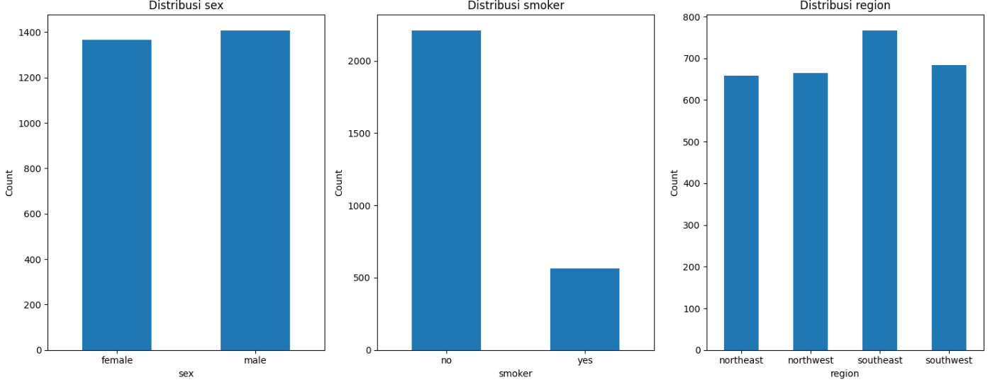
Grafik-grafik tersebut menunjukkan distribusi data kategori dalam dataset asuransi kesehatan. Pada grafik distribusi jenis kelamin (sex), terlihat bahwa jumlah responden laki-laki dan perempuan hampir seimbang, dengan sedikit lebih banyak laki-laki. Sementara itu, grafik distribusi status merokok (smoker) menunjukkan bahwa mayoritas responden adalah non-perokok, dengan jumlah perokok yang jauh lebih sedikit. Hal ini dapat berdampak signifikan dalam analisis biaya asuransi karena merokok biasanya berhubungan dengan biaya medis yang lebih tinggi. Terakhir, distribusi wilayah (region) menunjukkan bahwa data tersebar cukup merata di antara empat wilayah yang tersedia, meskipun wilayah southeast memiliki jumlah responden tertinggi dan northeast paling rendah. Distribusi yang relatif seimbang ini penting untuk memastikan representasi yang adil dalam analisis model.
- Numerical Features
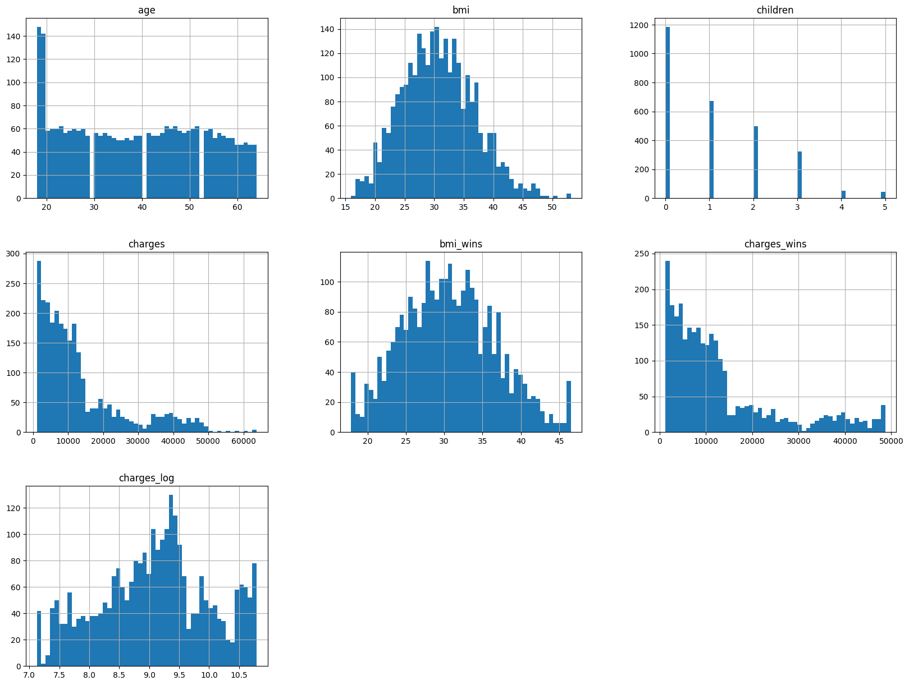
Gambar tersebut menampilkan distribusi dari fitur-fitur numerik dalam dataset asuransi kesehatan. Distribusi age (usia) menunjukkan bahwa sebagian besar responden berusia muda, dengan penurunan jumlah pada usia yang lebih tua. Distribusi bmi berbentuk menyerupai distribusi normal dengan puncak di sekitar 30, yang menunjukkan rata-rata indeks massa tubuh berada di kategori overweight. Fitur children memperlihatkan bahwa mayoritas responden tidak memiliki anak atau hanya memiliki satu hingga dua anak. Distribusi charges (biaya medis) tampak sangat miring ke kanan (right-skewed), menandakan adanya outlier dengan biaya yang sangat tinggi. Untuk menangani outlier, dilakukan transformasi: bmi_wins dan charges_wins adalah hasil dari winsorization, yang membatasi nilai ekstrem agar distribusinya lebih stabil. Sementara charges_log adalah hasil transformasi logaritma, yang berhasil membuat distribusi menjadi lebih mendekati normal. Transformasi ini penting untuk meningkatkan performa model regresi atau machine learning, karena model biasanya bekerja lebih baik dengan data yang terdistribusi normal dan tidak terlalu dipengaruhi oleh outlier.

2. Multivariate Analysis
- Categorical Features
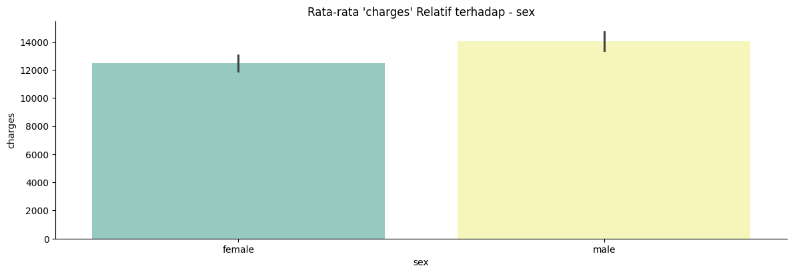
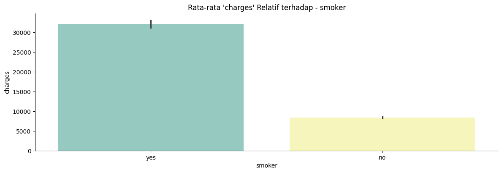
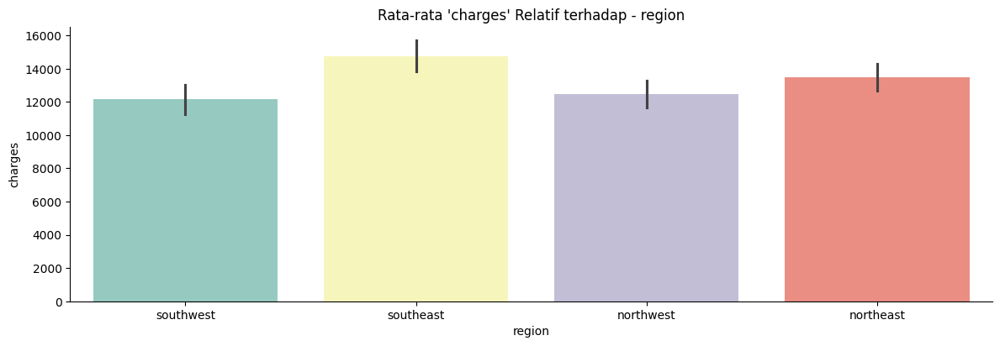
- Numerical Features
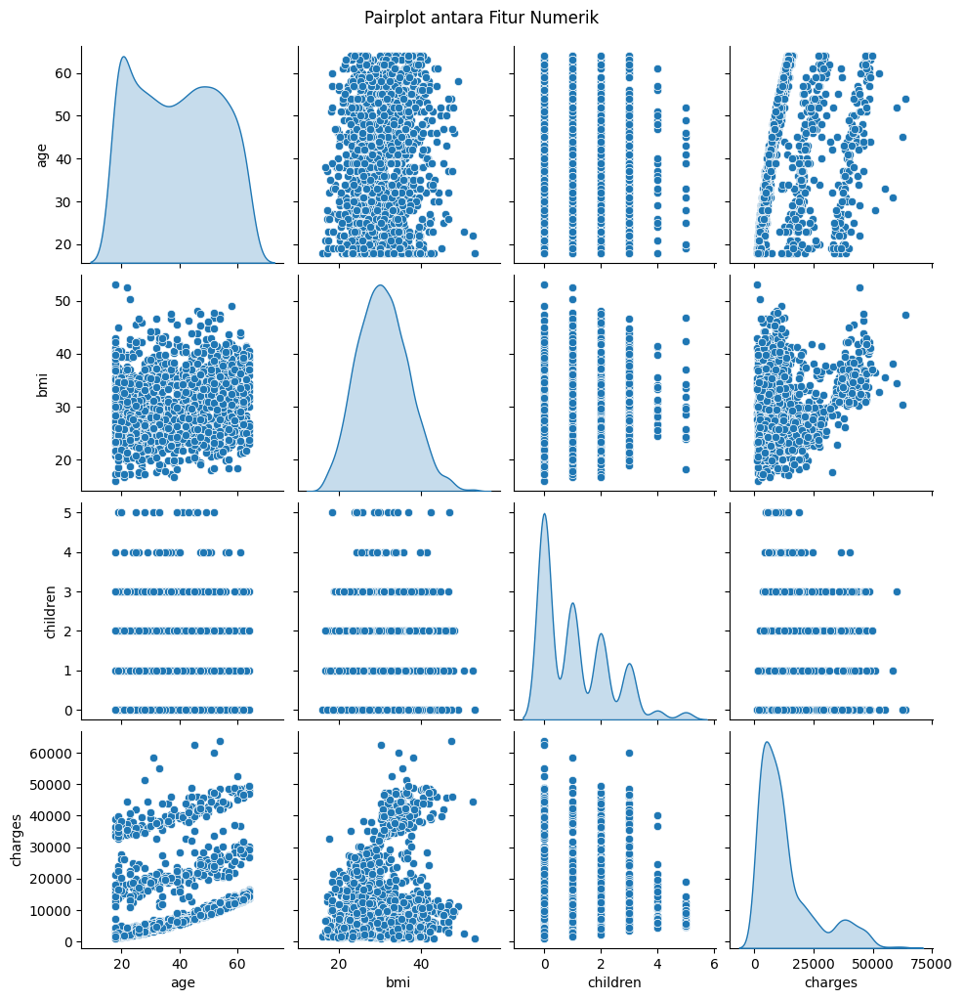
Pairplot tersebut menggambarkan hubungan antar fitur numerik dalam dataset asuransi kesehatan, yaitu age, bmi, children, dan charges. Beberapa insight penting yang dapat diambil:
a. Age vs Charges: Terlihat pola naik yang cukup jelas, menunjukkan bahwa semakin tua seseorang, cenderung semakin tinggi biaya medis (charges). Namun, hubungan ini tampaknya tidak linier sempurna, mungkin dipengaruhi oleh variabel lain seperti status merokok.
b. BMI vs Charges: Korelasi antara bmi dan charges tidak terlalu kuat secara umum, tetapi ada pola khusus di mana individu dengan bmi tinggi tampak memiliki charges yang lebih tinggi. Ini bisa jadi karena obesitas berkorelasi dengan kondisi kesehatan kronis.
c. Children vs Charges: Tidak terlihat pola yang jelas antara jumlah anak dengan biaya medis, artinya variabel children kemungkinan tidak memiliki pengaruh besar terhadap charges.
d. Dispersi Umum: Histogram diagonal menunjukkan bahwa:
- age terdistribusi bimodal.
- bmi mendekati distribusi normal.
- charges sangat skewed ke kanan.
- children bersifat diskrit dan mayoritas bernilai 0–2.

Untuk menganalisis hubungan antara fitur numerik dan fitur kategori, salah satu pendekatan yang dapat digunakan adalah dengan memanfaatkan correlation matrix menggunakan fungsi dari pandas, serta divisualisasikan dalam bentuk heatmap melalui library seaborn. Heatmap ini menampilkan tingkat korelasi antara pasangan fitur, di mana intensitas warna menggambarkan kekuatan korelasi—warna yang lebih terang menunjukkan korelasi yang kuat, sedangkan warna yang lebih gelap menandakan korelasi yang lemah atau tidak signifikan. Melalui nilai korelasi ini, kita dapat mengidentifikasi adanya hubungan positif atau negatif antara fitur-fitur tersebut. Analisis ini sangat berguna untuk memahami keterkaitan antar variabel dalam dataset, yang selanjutnya dapat membantu dalam proses pemilihan fitur, pembangunan model prediktif, maupun analisis lanjutan secara lebih mendalam.

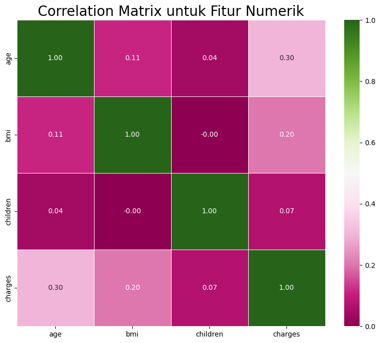
Gambar correlation matrix di atas menunjukkan hubungan antar fitur numerik dalam dataset. Terlihat bahwa fitur charges memiliki korelasi paling tinggi dengan age (0.30) dan bmi (0.20), meskipun korelasinya tergolong lemah. Sementara fitur children memiliki korelasi sangat rendah terhadap fitur lainnya. Secara umum, tidak ada korelasi yang sangat kuat antar fitur, namun analisis ini tetap berguna untuk memahami pola hubungan yang mungkin relevan dalam pemodelan.

## Data Preparation
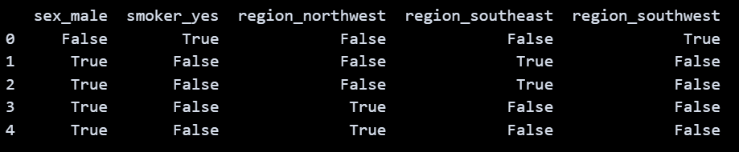
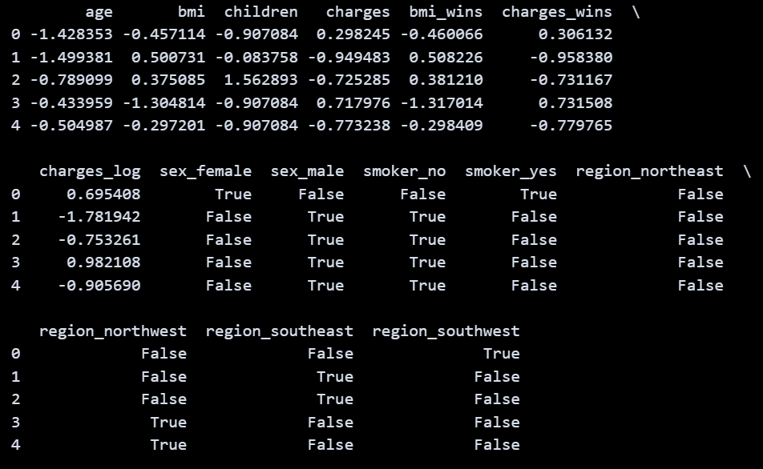

1. One Hot Encoding pada Fitur Kategorikal
Proses One Hot Encoding digunakan untuk mengubah fitur kategorikal (sex, smoker, dan region) menjadi format numerik biner. Ini penting karena sebagian besar algoritma machine learning tidak bisa menangani data dalam bentuk teks secara langsung. Dalam dataset ini, digunakan fungsi pd.get_dummies() dari pustaka Pandas untuk menghasilkan kolom-kolom baru berdasarkan setiap kategori unik dari fitur-fitur tersebut.
Contohnya:
- Fitur sex menghasilkan kolom sex_female dan sex_male
- Fitur smoker menghasilkan kolom smoker_no dan smoker_yes
- Fitur region menghasilkan kolom region_northeast, region_northwest, region_southeast, dan region_southwest

Kolom asli dari fitur kategorikal kemudian dihapus untuk menghindari duplikasi dan memastikan model hanya menggunakan versi biner dari fitur tersebut. Langkah ini membantu model mengenali perbedaan antar kategori tanpa mengasumsikan adanya hubungan ordinal (berurutan) di antara mereka.

2. Feature Scaling pada Fitur Numerik
Setelah fitur kategorikal diubah, dilakukan standardisasi (scaling) pada fitur numerik. Hal ini penting karena:
- Beberapa algoritma machine learning, seperti regresi linear dan KNN, sensitif terhadap skala data.
- Scaling membantu mempercepat proses pelatihan model dan membuat konvergensi lebih stabil.

Proses scaling dilakukan menggunakan StandardScaler dari sklearn.preprocessing, yang akan mengubah data sehingga memiliki rata-rata 0 dan standar deviasi 1. Fitur numerik seperti age, bmi, children, dan charges telah dinormalisasi dalam proses ini.

3. Pembagian Dataset ke Data Latih dan Data Uji
Langkah selanjutnya adalah memisahkan dataset menjadi:
- Data latih (training set): Digunakan untuk melatih model machine learning.
- Data uji (testing set): Digunakan untuk mengevaluasi performa model pada data baru yang belum pernah dilihat.

Pembagian dilakukan dengan rasio 80:20, yang merupakan praktik umum dalam pembelajaran mesin:
- 80% dari data digunakan untuk melatih model
- 20% sisanya digunakan untuk menguji generalisasi model terhadap data baru
Proses ini dilakukan menggunakan fungsi train_test_split() dari sklearn.model_selection.
Hasil ukuran data:
- Ukuran data latih (X_train) : (2217, 9)
- Ukuran data uji (X_test) : (555, 9)

## Modeling
Proyek ini menggunakan tiga algoritma regresi yaitu K-Nearest Neighbors (KNN) Regressor, Random Forest Regressor, dan AdaBoost Regressor. Ketiga algoritma ini digunakan untuk memprediksi biaya asuransi medis berdasarkan fitur-fitur yang relevan, seperti usia, jenis kelamin, BMI, jumlah anak, status perokok, dan wilayah.

1. K-Nearest Neighbors Regressor (KNN)
KNN adalah algoritma non-parametrik yang memprediksi nilai target berdasarkan rata-rata dari k tetangga terdekat dari titik data yang ingin diprediksi. 
- Cara Kerja: Dalam regresi, KNN mencari k titik data pelatihan terdekat (berdasarkan jarak Euclidean atau metrik lainnya) terhadap titik data uji, lalu menghitung rata-rata nilai target dari k tetangga tersebut sebagai hasil prediksi.
- Parameter: n_neighbors=10 artinya model mempertimbangkan 10 tetangga terdekat untuk setiap prediksi.
- Kelebihan: Mudah dipahami dan diimplementasikan dan Tidak membuat asumsi terhadap distribusi data.
- Kekurangan: Kinerja menurun pada dataset besar (lambat dalam prediksi), Sensitif terhadap skala data dan outliers, dan Tidak bisa menangani hubungan non-linear yang kompleks dengan baik.
- Hasil MSE: 
Training: 5,110,117.01
Testing: 8,586,196.00

2. Random Forest Regressor
Random Forest adalah algoritma ensemble berbasis decision tree. Ia membangun banyak pohon keputusan dan menggabungkan prediksinya (rata-rata) untuk regresi.
- Cara Kerja: Model membuat banyak pohon keputusan (trees) yang dilatih dengan subset acak dari data dan subset fitur (bagging), lalu mengambil rata-rata prediksi dari seluruh pohon.
- Parameter:
max_features=7: jumlah maksimum fitur yang dipertimbangkan pada setiap split.
max_depth=3: kedalaman maksimum pohon.
random_state=123: untuk replikasi hasil.
- Kelebihan: Mampu menangani hubungan non-linear dan interaksi antar fitur dan Lebih tahan terhadap overfitting dibanding decision tree tunggal.
- Kekurangan: Interpretasi model lebih sulit dibanding pohon tunggal dan Waktu pelatihan lebih lama dibanding model sederhana seperti KNN.
- Hasil MSE:
Training: 1,836,508.95
Testing: 1,341,165.86 (paling rendah)

3. AdaBoost Regressor
AdaBoost adalah teknik boosting yang menggabungkan banyak model lemah (biasanya decision stumps) menjadi model kuat secara iteratif.
- Cara Kerja: Melatih model sederhana secara berurutan, di mana setiap model berikutnya mencoba untuk memperbaiki kesalahan dari model sebelumnya dengan memberikan bobot lebih besar pada kesalahan sebelumnya.
- Parameter:
n_estimators=3: jumlah model lemah (pohon keputusan kecil) yang akan digabung.
learning_rate=0.2: tingkat kontribusi setiap model terhadap keseluruhan.
random_state=123: untuk hasil replikasi.
- Kelebihan: Mampu meningkatkan akurasi model sederhana dan Dapat menangani outliers lebih baik dibanding pohon keputusan tunggal.
- Kekurangan: Bisa mengalami overfitting jika jumlah estimators terlalu banyak atau learning rate terlalu besar dan Sensitif terhadap outliers dan noise jika tidak dikonfigurasi dengan baik.
- Hasil MSE:
Training: 2,878,328.74
Testing: 2,617,873.50

Tahapan Proses Modelling
1. Melatih model menggunakan data training (X_train, y_train) dengan algoritma:
- KNN Regressor
- Random Forest Regressor
- AdaBoost Regressor
2. Evaluasi pada data training menggunakan metrik Mean Squared Error (MSE).
3. Evaluasi pada data testing juga menggunakan metrik MSE.
4. Membandingkan hasil evaluasi model antara data training dan testing.
5. Menentukan model terbaik berdasarkan nilai MSE pada data testing.

Berdasarkan hasil evaluasi, Random Forest Regressor menghasilkan nilai MSE terendah pada data testing, yaitu 1,341,165.87, yang menunjukkan bahwa model ini memberikan prediksi biaya asuransi yang paling akurat dibanding KNN dan AdaBoost dalam konteks dataset ini. Alasan Memilih Random Forest sebagai Model Terbaik:
- Alasan Memilih Random Forest sebagai Model Terbaik:
- Memiliki kemampuan menangani hubungan non-linear dan interaksi antar fitur yang kompleks.
- Lebih stabil terhadap overfitting dibanding model boosting atau KNN dalam konfigurasi ini.

## Evaluation
Dalam proyek ini, metrik evaluasi yang digunakan adalah Mean Squared Error (MSE). MSE berfungsi untuk mengukur seberapa besar perbedaan antara nilai prediksi dan nilai aktual dalam kasus regresi. Nilainya diperoleh dengan menghitung rata-rata dari kuadrat selisih antara hasil prediksi (ŷ) dan nilai sebenarnya (y). Semakin kecil nilai MSE, maka semakin baik performa model dalam melakukan prediksi. Rumus perhitungannya adalah MSE = (Σ(y - ŷ)²) / n, di mana n merupakan jumlah sampel. Karena hasilnya berupa kuadrat, satuan MSE berbeda dengan variabel aslinya dan perlu ditafsirkan dengan hati-hati atau dibandingkan dengan metrik lain.

Evaluasi dilakukan terhadap tiga model regresi: K-Nearest Neighbors (KNN), Random Forest, dan AdaBoost. Hasil MSE pada data pelatihan (train set) dan pengujian (test set) adalah sebagai berikut:
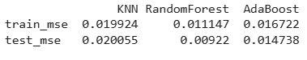
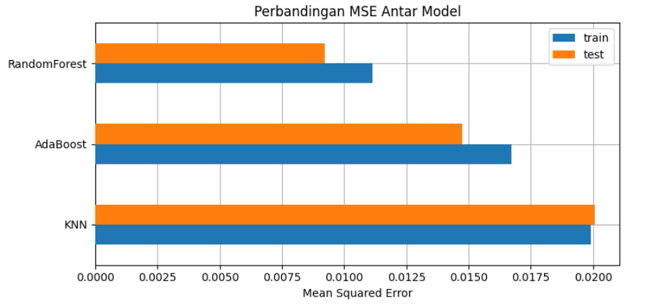

1. K-Nearest Neighbors (KNN)
- Train MSE: 5,110,117.01
- Test MSE: 8,586,196.00

Model KNN menunjukkan performa terburuk di antara ketiga model, dengan nilai MSE yang tinggi di baik data pelatihan maupun pengujian. Hal ini mengindikasikan bahwa KNN kurang mampu menangkap pola kompleks pada data premi asuransi. Ini sesuai dengan fungsinya sebagai baseline model, dan menunjukkan bahwa model yang lebih kompleks diperlukan untuk mencapai akurasi yang lebih baik.

2. AdaBoost
- Train MSE: 2,878,328.74
- Test MSE: 2,617,873.51

Model AdaBoost memiliki performa yang lebih baik daripada KNN dan cukup kompetitif. Nilai MSE pada test set cukup rendah dan mendekati nilai pada train set, menandakan generalisasi yang cukup baik. Sebagai model boosting, AdaBoost mampu menangani kesalahan secara iteratif, dan cocok untuk memperbaiki model lemah. Namun, performanya masih di bawah Random Forest.

3.  Random Forest
- Train MSE: 1,836,508.95
- Test MSE: 1,341,165.87

Model Random Forest merupakan model terbaik dalam proyek ini berdasarkan nilai MSE yang paling rendah baik pada data training maupun testing. Ini menunjukkan bahwa Random Forest mampu belajar dengan baik dari data tanpa overfitting, serta dapat memprediksi premi asuransi dengan tingkat akurasi tinggi. Model ini juga memungkinkan interpretasi melalui analisis feature importance, mendukung transparansi dalam penetapan premi.

Interpretasi Berdasarkan Tujuan Proyek
1. Akurasi Prediksi Tinggi
Random Forest secara konsisten menunjukkan nilai MSE yang paling rendah. Hal ini menjawab Pernyataan Masalah 1 dan Goal 1, yaitu mengembangkan model prediktif yang akurat untuk memperkirakan biaya premi asuransi kesehatan berdasarkan karakteristik individu seperti usia, BMI, dan kebiasaan merokok.
2. Transparansi Penetapan Premi
Dengan kemampuan Random Forest untuk menunjukkan feature importance, proyek ini juga menjawab Pernyataan Masalah 2 dan Goal 2 tentang transparansi. Calon pemegang polis dapat memahami faktor-faktor apa saja yang paling memengaruhi besaran premi mereka.
3. Manajemen Risiko Keuangan Perusahaan
Prediksi premi yang akurat membantu perusahaan menetapkan biaya yang seimbang dengan risiko kesehatan nasabah. Ini sejalan dengan Pernyataan Masalah 3 dan Goal 3, yaitu membantu perusahaan asuransi menghindari kerugian karena premi yang tidak sesuai dengan risiko.

Model Random Forest memberikan performa terbaik dan paling direkomendasikan untuk digunakan dalam sistem prediksi biaya asuransi ini.

KESIMPULAN:
Proyek ini berhasil mengembangkan model analisis prediktif menggunakan algoritma Random Forest yang mampu memperkirakan premi asuransi kesehatan dengan tingkat akurasi yang paling tinggi dibandingkan dengan model AdaBoost dan K-Nearest Neighbors (KNN). 
Hasil evaluasi menunjukkan bahwa Random Forest memiliki nilai MSE paling rendah pada data training maupun test set, dengan nilai:
- MSE Train Set: 1,836,508.95
- MSE Test Set: 1,341,165.86

Angka ini menunjukkan bahwa Random Forest memberikan prediksi premi yang lebih akurat dibandingkan dengan AdaBoost (MSE test 2,617,873.50) dan KNN (MSE test 8,586,196.00). Hal ini mengindikasikan bahwa model Random Forest memiliki generalisasi yang baik dan mampu menangkap kompleksitas hubungan antara fitur-fitur seperti usia, BMI, status merokok, dan jumlah anak terhadap besaran premi.

References:
Michael Chernew, David M Cutler, and Patricia Seliger Keenan, "Increasing Health Insurance Costs and the Decline in Insurance Coverage, " Health Services Research, vol.40, no.10.1111. 2005.
